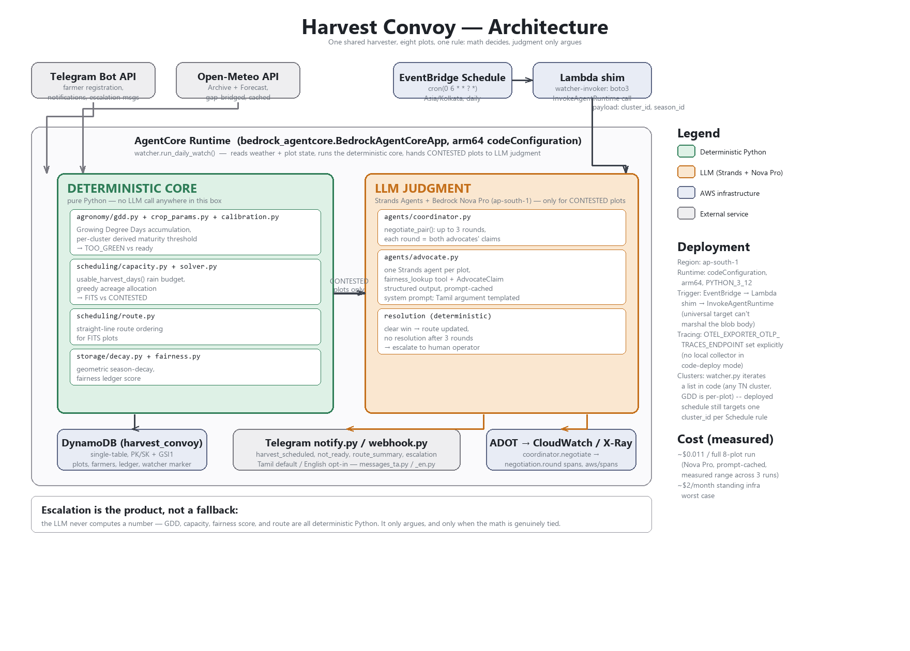

# Architecture

## The rule everything else follows from

Harvest Convoy makes one architectural bet: **the LLM never computes a
number.** Every fact that has a correct answer — accumulated Growing
Degree Days, whether a plot fits inside today's rain-limited harvest
capacity, which order the machine should visit fitting plots in, how much
a farmer's fairness score should weigh — is deterministic Python. It's
unit-tested the same way you'd test any other function, because it *is*
just another function: same inputs, same outputs, every time.

The LLM (Bedrock Nova Pro, via Strands Agents) does exactly two things:

1. **Argues a plot's case** when — and only when — the deterministic
   scheduler genuinely can't separate two plots (a tie inside the
   capacity budget). This is where judgment actually belongs: "whose
   case is more compelling" isn't a number you compute, it's a
   comparison you make.
2. **Writes the message a farmer reads.** Structured facts go in
   (`PlotFacts`), a short natural-language argument comes out
   (`AdvocateClaim.argument`, capped at 25 words) — and every *factual*
   field on that returned claim is overwritten with ground truth before
   it's used anywhere. The model's own claims about GDD, urgency, or
   maturity are never trusted, only its persuasion.

This split is enforced in code, not just documented as intent — see
`agents/advocate.py`'s `get_advocate_claim()`, which constructs the
`AdvocateClaim` from `PlotFacts` fields directly and only accepts
`argument`/`concedes` from the model's structured output.

## Request flow, end to end

1. **EventBridge Schedule** fires daily at 06:00 `Asia/Kolkata`.
2. It invokes a **Lambda shim** (`harvest-convoy-watcher-invoker`), not
   the AgentCore Runtime directly — see "Why a Lambda shim" below.
3. The shim calls **`InvokeAgentRuntime`** via boto3 with
   `{"cluster_id": "kamatchipuram", "season_id": "2026-kuruvai"}` — the
   deployed Schedule rule targets one `cluster_id`. `watcher.run_daily_watch()`
   itself accepts either a single `cluster_id` or a list and iterates
   independently per cluster (see "Multi-cluster" below) — that capability
   exists in code and is tested, but the deployed schedule wasn't
   repointed at it, a deliberate scope boundary, not an oversight.
4. Inside the **AgentCore Runtime**, `app.py`'s entrypoint calls
   `watcher.run_daily_watch()`, which:
   - fetches live rain forecast (Open-Meteo) for the cluster's machine
     start point, and live daily temperatures for every plot since its
     `transplant_date`. A forecast request spans the full 16-day
     horizon, but Open-Meteo computes near-term days first — a trailing
     run of not-yet-computed days is trimmed to a shorter, still-real
     usable window rather than failing the whole run; a null anywhere
     else in the series is a genuine gap and still fails loud (caught
     live, see `weather/openmeteo.py:get_precipitation_forecast`);
   - checks the trigger condition: does `usable_harvest_days()` return
     less than the full forecast horizon? (Is rain coming within the
     window, i.e. is there actually something to react to?) If not:
     log a clean no-op, write the idempotency marker, done — **silence
     is the product** when nothing needs to change.
   - if triggered: runs `solve()` — the deterministic core — which
     classifies every plot `TOO_GREEN` / `FITS` / `CONTESTED` and orders
     the `FITS` plots into a route, against a **maturity threshold
     derived from this cluster's own climatology**
     (`agronomy/calibration.py`) when one has been calibrated, falling
     back to a documented reference constant (loudly logged) otherwise.
5. **`CONTESTED` plots only** go to `coordinator.run_cluster()`, which
   pairs them up and runs `negotiate_pair()`: each side gets an advocate
   agent, both argue, and either one side's case is clearly stronger (a
   deterministic score comparison, not an LLM decision) or — after 3
   rounds with no resolution — the pair **escalates to a human operator**
   via Telegram, with both sides' arguments shown side by side. The
   advocate's `argument` prose is model-generated for an
   English-registered farmer's plot; for a Tamil-registered one it's
   templated deterministically from the same structured facts instead —
   live testing found Nova Pro cannot reliably produce valid Tamil
   script (see "What we learned building Tamil support" in the README).
   `concedes` stays a genuine live model judgment either way.
6. Results persist to **DynamoDB** (route, fairness ledger, watcher
   marker) and go out via **Telegram** (`notify.py` for farmers,
   `webhook.py` for the operator's escalation response) — Tamil by
   default per farmer, English on request
   (`telegram/messages_ta.py`/`messages_en.py`).
7. Every step is wrapped in **OpenTelemetry spans**
   (`app.daily_watch` → `coordinator.run_cluster` →
   `coordinator.negotiate` → `negotiation.round` → `advocate.get_claim` →
   Strands' own `invoke_agent`/`execute_event_loop_cycle` spans),
   exported to **CloudWatch / X-Ray**.

### Multi-cluster: works in code, deployed schedule stays single-cluster

GDD accumulation is computed per-plot from that plot's own coordinates —
nothing in the deterministic core hardcodes a district. Two independent
demo clusters exist as evidence: **Kamatchipuram** (Theni district) and
**Naducauvery** (Thanjavur district, Cauvery delta) — different climate,
same code, seeded via `scripts/seed_cluster.py` /
`scripts/seed_cluster_naducauvery.py`. `watcher.run_daily_watch()`
accepts a list of cluster IDs and runs each independently (one
cluster's failure doesn't block another's), tested end-to-end against
both real clusters. The deployed EventBridge Schedule still targets
Kamatchipuram only — repointing the live schedule at multiple clusters
is a deliberate follow-up, not done here, so the one thing running
unattended on a cron stays the thing that's been running the whole
project, not something changed the same week as filming.

## Package layout

| Module | Responsibility | LLM? |
|---|---|---|
| `agronomy/gdd.py`, `crop_params.py` | Growing Degree Day accumulation, reference maturity threshold (documented fallback) | No |
| `agronomy/calibration.py` | Derives a cluster's own maturity threshold from its real climatology (reuses `weather/openmeteo.py`) | No |
| `agronomy/decay.py` | Overripe urgency curve | No |
| `scheduling/capacity.py` | Rain-day harvest budget | No |
| `scheduling/route.py` | Straight-line route ordering | No |
| `scheduling/solver.py` | Combines the above into `TOO_GREEN`/`FITS`/`CONTESTED`, against a cluster's calibrated (or fallback) threshold | No |
| `storage/fairness.py` | Fairness ledger, geometric season decay | No |
| `agents/advocate.py` | One Strands agent per plot; structured `AdvocateClaim` output. `argument` is model-generated for English, templated from facts for Tamil (`concedes` is model judgment either way) | **Yes** (`concedes`, and `argument` for English) |
| `agents/coordinator.py` | Pairwise negotiation, round-capping, escalation | Orchestrates LLM calls; the negotiation *logic* (round counting, score comparison, escalation payload) is deterministic |
| `storage/interface.py`, `file_storage.py`, `dynamo.py` | Shared `Storage` Protocol, two interchangeable backends | No |
| `telegram/client.py`, `notify.py`, `registration.py`, `webhook.py` | Bot API wrapper, outbound messages, registration flow, inbound/callback handling — dispatches by `Farmer.language`/`Cluster.operator_language` | No |
| `telegram/messages_ta.py`, `messages_en.py` | Hand-authored message templates per language, same function shape in both | No |
| `weather/openmeteo.py` | Archive + Forecast client, gap-bridged, cached; trims a trailing not-yet-computed forecast day instead of failing the whole request | No |
| `observability/otel.py` | Tracing setup: console locally, AWS ADOT distro when deployed | No |
| `watcher.py` | Daily orchestration entrypoint; accepts one cluster ID or a list, iterates each independently | Calls into the above |
| `app.py` | AgentCore Runtime entrypoint — thin wrapper around `watcher.run_daily_watch()`, still called with a single `cluster_id` on the deployed path | No |

## Deployment topology

Region **`ap-south-1`** throughout (matches where Bedrock Nova Pro and
AgentCore Runtime are available).

- **AgentCore Runtime**, `codeConfiguration` (not a container) — a zipped
  source tree plus vendored `arm64` dependencies, no Docker involved. See
  ADR-006 Decision 1 for why code deployment over container deployment.
- **DynamoDB**, single-table design: `PK`/`SK` plus one GSI
  (`GSI1PK`/`GSI1SK`) for cluster-to-children queries (plots, farmers,
  fairness ledger entries, the watcher's idempotency marker). See
  ADR-005.
- **Lambda shim** between EventBridge and the Runtime — see below.
- **EventBridge Schedule**, plain cron, `Asia/Kolkata` timezone.
- **CloudWatch / X-Ray**, receiving OTel spans exported directly by
  AWS's ADOT distro running inside the Runtime process — no custom
  SigV4 signing code of our own.

### Why a Lambda shim, not a direct Scheduler → Runtime call

`InvokeAgentRuntime`'s request body is a raw blob (a "payload trait"
shape in the API model — the entire HTTP body, not a JSON object with
named fields), with `contentType`/`accept` as *header*-located fields.
EventBridge Scheduler's universal target marshals a plain JSON object
into a standard JSON body; that mechanism doesn't fit an API whose body
*is* a blob. It fails at the API call itself, after `AssumeRole`
succeeds — confirmed live via CloudWatch's `AWS/Scheduler` metrics
(`InvocationAttemptCount=1`, `TargetErrorCount=1`) with zero
corresponding log lines in the runtime. The fix is a ~20-line Lambda that
calls the same API through boto3 (which handles blob-body marshalling
correctly) and gets targeted the ordinary, well-supported Lambda target
type instead. Full root-cause writeup: ADR-006 Decision 7.

### Why an explicit OTLP traces endpoint

AWS's ADOT distro, given only `AGENT_OBSERVABILITY_ENABLED=true`, falls
back to a plain `OTLPSpanExporter` pointed at the OTel-standard default
(`localhost:4318`) — which nothing listens on in a direct-code (non-
container) Runtime deployment. Reading `aws_opentelemetry_configurator.py`
directly shows it only switches to a SigV4-signed direct-to-X-Ray
exporter when `OTEL_EXPORTER_OTLP_TRACES_ENDPOINT` is set explicitly and
matches `https://xray.<region>.amazonaws.com/v1/traces`. One environment
variable, no code or dependency change. Full root-cause writeup: ADR-006
Decision 8.

## Design decisions, in full

Every non-obvious choice — why Telegram over WhatsApp, why `transplant_date`
over `sowing_date` as the GDD anchor, why fairness can never outrank
agronomic urgency (the `MAX_FAIRNESS_BONUS` invariant), why AgentCore
Memory was considered twice and skipped both times — is written up as an
ADR, in the order the decisions were made:

- [ADR-000](docs/adr/ADR-000-stack-and-architecture.md) — stack and core architecture
- [ADR-001](docs/adr/ADR-001-agronomy-core.md) — GDD math, Open-Meteo seam
- [ADR-002](docs/adr/ADR-002-scheduling-core.md) — maturity threshold reconciliation, capacity/route math
- [ADR-003](docs/adr/ADR-003-strands-agents.md) — Strands integration, the ground-truth-override rule
- [ADR-004](docs/adr/ADR-004-telegram.md) — Telegram integration, message design
- [ADR-005](docs/adr/ADR-005-persistence-fairness.md) — DynamoDB schema, fairness ledger
- [ADR-006](docs/adr/ADR-006-deploy.md) — AWS deployment, both live-found bugs and their fixes
- ADR-007 — number never assigned; no such document was ever written or removed
- [ADR-008](docs/adr/ADR-008-tn-generalization-and-tamil.md) — Tamil Nadu generalization (per-cluster GDD, second cluster), Tamil-language farmer interface, and the live-verified Nova Pro Tamil-script finding
- [ADR-009](docs/adr/ADR-009-harvest-lifecycle-and-validation.md) — 2025 historical backtest, the plot-harvest-lifecycle correctness bug it surfaced, harvest confirmation loop, registration-time maturity projection, post-harvest drying-window rain alert
- [ADR-010](docs/adr/ADR-010-reporting-decision-replay-equity-machinery.md) — persisted per-decision records (the audit-trail gap fixed at the source), `explain_decision.py`, `equity_report.py`, `machinery_gap.py`
- [ADR-011](docs/adr/ADR-011-rollover-breakdown-rain-classification-advance-notice.md) — seasonal rollover, machine breakdown handling, rain event classification, advance harvest notice
- [ADR-012](docs/adr/ADR-012-operator-authorization-and-enrollment.md) — callback authorization audit (three unauthenticated mutation paths found and fixed), one-time-code operator self-enrollment, the farmer/operator onboarding asymmetry documented
